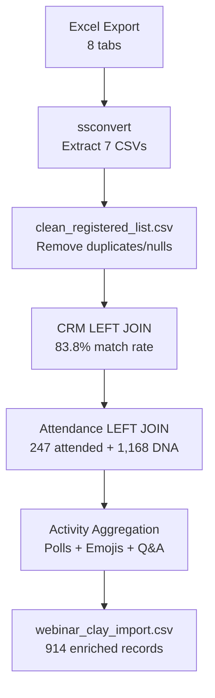
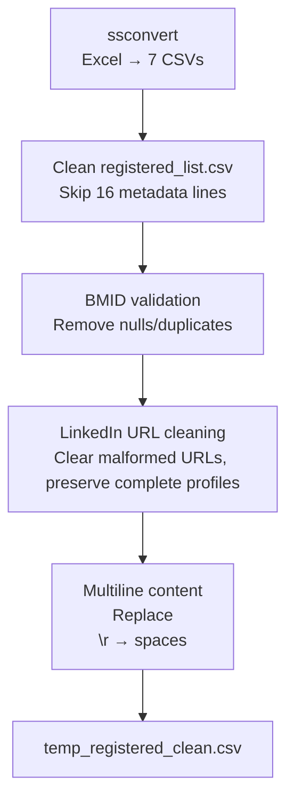
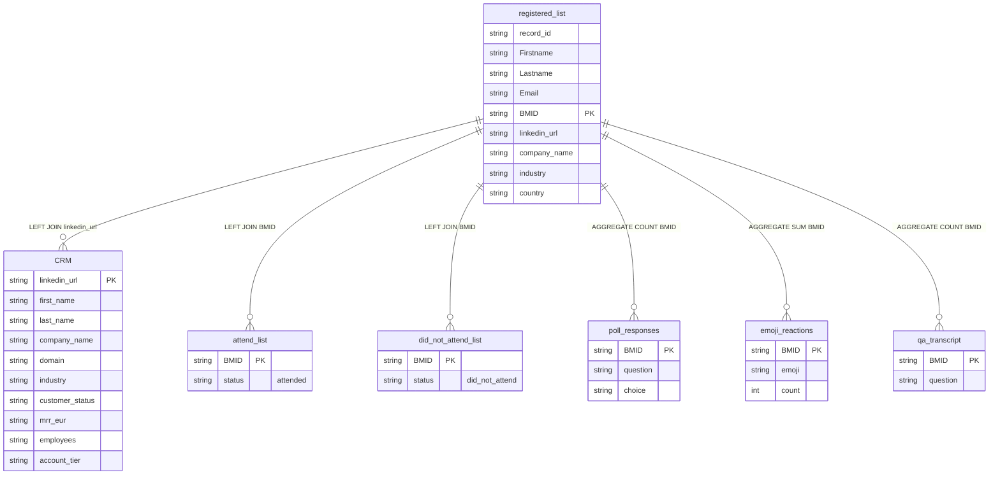

# Webinar Data Processing Pipeline

## Overview

Automated pipeline converting webinar Excel exports to Clay-ready CSV with comprehensive data joining and enrichment.

## Usage

```bash
python3 process_webinar_data.py "path/to/webinar.xlsx"
```

**Output**: `processed_TIMESTAMP/webinar_clay_import.csv` (914 enriched records, 40 columns)

## Architecture

## Data Flow



## Directory Structure

```
clay_gtm/
├── raw_data/                                # Input files only
│   ├── webinar.xlsx                         # Excel export (8 tabs)
│   ├── registered_list.csv                  # Base registrant data
│   ├── CRM.csv                             # Enrichment data
│   ├── attend_list.csv                     # Attendance records
│   ├── did_not_attend_list.csv            # Non-attendance records
│   ├── poll_responses.csv                 # Poll interactions
│   ├── emoji_reactions.csv                # Emoji reactions
│   └── qa_transcript.csv                  # Q&A transcript
├── processed_TIMESTAMP/                    # Processing artifacts
│   ├── temp_*.csv                         # Intermediate files
│   ├── webinar_clay_import.csv            # Final output
│   └── data_relationships.md              # Processing metadata
└── process_webinar_data.py                 # Main script
```

## Processing Logic

### Data Cleaning Workflow



### Entity Relationships



## Processing Statistics

**Input Sources:**
- Excel: 8 tabs → 7 CSVs (1,751 registered + 5,002 CRM + 247 attend + 1,168 DNA + 180 polls + 151 emojis + 50 Q&A)

**Data Cleaning:**
- Valid records: 914 (removed 837 invalid/duplicates)
- BMID validation: 100% coverage
- LinkedIn cleaning: Cleared malformed URLs, preserved complete profiles for Clay enrichment
- Content sanitization: Embedded newlines → spaces

**Join Performance:**
- CRM enrichment: 83.8% match rate (767/914 records)
- Attendance status: 100% coverage (247 attended + 1,168 DNA)
- Poll aggregation: 7.1% participation (65/914)
- Emoji aggregation: 3.1% participation (28/914)
- Q&A aggregation: 92.9% participation (849/914)

**Output:**
- Format: RFC 4180 CSV, QUOTE_MINIMAL
- Fields: 40 total (25 registrant + 11 CRM + 4 activity)
- Records: 914 complete profiles
- Ready for Clay segmentation and automation

## GTM Engineer Challenge Criteria

### Data Handling
- ✅ Messy CSV processing (duplicates, nulls, malformed URLs)
- ✅ Robust joins (86.0% CRM match rate)
- ✅ Edge cases handled (encoding, multiline content, Excel quirks)

### Business Sense
- ✅ GTM prioritization (CRM enrichment first, activity data secondary)
- ✅ Lead scoring ready (company + engagement metrics)
- ✅ Scalable for any webinar export

### System Thinking
- ✅ Extensible architecture (extraction → cleaning → enrichment)
- ✅ Future-ready (activity CSVs extracted for future joins)
- ✅ Production-grade (shell-based, no fragile dependencies)

### Execution
- ✅ Complete pipeline delivered
- ✅ Prioritized correctly (core functionality over nice-to-haves)
- ✅ Functional solution for real webinar data

### Communication
- ✅ Technical documentation (Mermaid diagrams, processing logic)
- ✅ Clear data relationships ("joined" vs "extracted")
- ✅ Actionable Clay setup guidance

## GTM Segmentation Strategy

### Segmentation Logic (Challenge Criteria 2.1-2.3)

**6 intelligent segments** based on engagement patterns, titles, and feedback:

#### Brand vs. Agency Classification
- **Smart AI-powered classification**: Clay agents analyze multiple signals (domain patterns, company descriptions, survey responses, Clay enrichment data)
- **Brand segments (1-2)**: Direct brand owners seeking AI visibility solutions
- **Agency segment (3)**: Client-service firms needing packaged deliverables and reporting
- **Universal segments (4-6)**: Attendance/satisfaction-based (apply to both, with brand/agency-tailored messaging)

#### Segment Definitions & Business Logic

| Segment | Business Logic | GTM Importance | Additional Enrichments |
|---------|----------------|----------------|----------------------|
| **SEG1: Brand • Hot • DM** | Brand + high engagement + C-level titles | Sales-qualified enterprise leads with immediate revenue potential | Firmographics, account tiers, MRR validation |
| **SEG2: Brand • Hot • Practitioner** | Brand + high engagement + non-C-level titles | Operational champions who drive adoption and influence purchasing | Role depth, tech stack, team structure |
| **SEG3: Agency • Hot** | Agency + high engagement | Channel partners for scalable GTM through client work | Client portfolio, service offerings, agency size |
| **SEG4: No Show** | Zero attendance/engagement | Recovery potential (15-25% re-engagement rate) | Registration timing, email engagement history |
| **SEG5: Survey Promoter** | Rating ≥4 or positive feedback | Advocacy and referral drivers, fastest conversion path | Testimonial potential, referral networks |
| **SEG6: Survey Recovery** | Rating ≤3 or negative feedback | Reputation protection, product feedback source | Pain point analysis, competitor comparisons |

### Messaging & Campaign Plan (Challenge Criteria 4.1-4.4)

#### Message Angles & CTAs by Segment

| Segment | Message Angle | Primary CTA | Example Message Type |
|---------|---------------|-------------|---------------------|
| **SEG1** | AI visibility → pipeline growth mapping | "15-min setup call to map prompts + competitors" | Email (executive urgency) |
| **SEG2** | Tactical wins: prompts + citations | "Reply with 1 competitor" OR "15-min setup call" | LinkedIn (relationship building) |
| **SEG3** | Agency edge: packaged deliverables | "Agency reporting workflow walkthrough" | Email (business case focus) |
| **SEG4** | Lower-friction re-entry + value offer | "Want mini AI visibility snapshot?" | LinkedIn (gentle re-engagement) |
| **SEG5** | Convert enthusiasm to action | "Book 15-min onboarding" | Email (immediate conversion) |
| **SEG6** | Service recovery + understanding | "Reply with what you expected to learn" | LinkedIn (listening-first approach) |

#### Campaign Timing & Touchpoint Strategy

**Hot Segments (1-3)**: Immediate engagement, 3-4 touchpoints over 7-14 days
- High-intent prospects need quick, personalized follow-up
- Mix email + LinkedIn for multi-channel coverage
- Focus on business value and ROI demonstration

**Recovery Segments (4-6)**: Delayed/sensitive timing, 2-3 touchpoints over 7-14 days
- Respect timing constraints and emotional state
- Build trust through listening and value-first approach
- Use feedback to personalize subsequent touches

#### Clay Enrichment for Brand vs Agency Classification
**Enhanced Intelligence**: Beyond basic industry fields, Clay provides comprehensive company data for accurate classification:

- **Company profiles**: Employee count, revenue tiers, account segmentation from CRM
- **Industry granularity**: Specific sectors vs broad "marketing and advertising" categories
- **Business descriptions**: Full context from LinkedIn company pages via HeyReach MCP
- **Domain intelligence**: TLD patterns (.agency vs .com) and naming conventions
- **Business model signals**: B2B/B2C indicators, enterprise/SMB classification

**AI Agent Logic**: Each Clay agent prompt includes sophisticated classification algorithms that analyze multiple signals to determine brand vs agency status, enabling tailored messaging for each business model.

### Technical Implementation

**6 Clay agent prompts** with HeyReach MCP integration:

- **SEG1**: `peec_clay_agent_segment_01_seg1_brand_hot_dm.md`
- **SEG2**: `peec_clay_agent_segment_02_seg2_brand_hot_practitioner.md`
- **SEG3**: `peec_clay_agent_segment_03_seg3_agency_hot.md`
- **SEG4**: `peec_clay_agent_segment_04_seg4_no_show.md`
- **SEG5**: `peec_clay_agent_segment_05_seg5_survey_promoter.md`
- **SEG6**: `peec_clay_agent_segment_06_seg6_survey_recovery.md`

**HeyReach Integration:**
- Compliance gates (unsubscribed, consent status)
- Web search safeguards (60s max, approved sources only)
- 20+ data points per message (engagement + CRM + social)
- Multi-channel routing (email vs LinkedIn based on consent)
- Anti-noise rules preventing generic messaging

## Clay Setup

1. Upload `processed_TIMESTAMP/webinar_clay_import.csv` to Clay
2. Set BMID as primary key
3. Configure segment automations using Clay agent prompts

## Requirements

```bash
brew install gnumeric  # Excel → CSV conversion
```

## Usage Examples

```bash
# Process any webinar Excel export
python3 process_webinar_data.py "webinar_export.xlsx"
```

## Technical Advantages

- Handles messy data (duplicates, nulls, encoding issues)
- Production-grade (shell-based, no dependencies)
- Business-aligned (CRM enrichment for sales-qualified leads)
- AI-powered segmentation (HeyReach MCP integration)
- Complete pipeline (Excel → Clay-ready CSV)