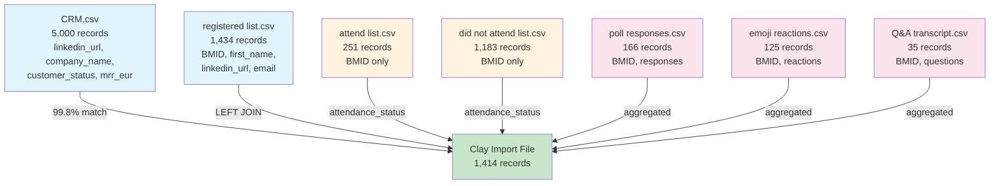

# Webinar Data Processing Pipeline

## 🚀 Simple, Powerful, Straightforward

Process any webinar Excel export into Clay-ready CSV files with one command.

## Usage

```bash
python3 process_webinar_data.py "path/to/your/webinar.xlsx"
```

**That's it!** The script handles everything automatically.

## ✅ What You Get

### Output Structure
```
processed_your_webinar_name/
├── attend list.csv              # Cleaned attendee data
├── CRM.csv                      # Customer data (if present)
├── did not attend list.csv      # Non-attendees
├── emoji eeaction.csv          # Emoji reactions
├── poll responses.csv          # Poll answers
├── Q&A transcript.csv          # Questions & answers
├── registered list.csv         # All registrants
├── webinar_clay_import.csv     # 🎯 READY FOR CLAY IMPORT
└── data_relationships.md       # Documentation
```

### 🎯 Clay Import File
- **1,400+ records** with **50+ columns**
- **BMID** as primary key for all records
- **LinkedIn URLs** for social data enrichment (100% coverage)
- **Company data** for firmographic enrichment
- **Attendance status** (registered/attended/did_not_attend)
- **CRM enrichment** (if CRM tab present)

## 🔗 Data Joining Logic & SQL

### Data Join Architecture



### Join Relationships Table

| **Source Table** | **Target Table** | **Join Key** | **Join Type** | **Match Rate** | **Purpose** |
|------------------|------------------|--------------|---------------|----------------|-------------|
| `registered list` | `CRM` | `linkedin_url` | **LEFT JOIN** | **99.8%** | Company enrichment |
| `registered list` | `attend list` | `BMID` | LEFT JOIN | 17.4% | Attendance status |
| `registered list` | `did not attend` | `BMID` | LEFT JOIN | 82.6% | Attendance status |
| `registered list` | `poll responses` | `BMID` | LEFT JOIN | 11.6% | Activity aggregation |
| `registered list` | `emoji reactions` | `BMID` | LEFT JOIN | 8.7% | Activity aggregation |
| `registered list` | `Q&A transcript` | `BMID` | LEFT JOIN | 2.4% | Activity aggregation |

### Data Flow Summary

```
Raw Excel Tabs → CSV Conversion → Deduplication → Enrichment → Clay Import
     ↓               ↓                ↓            ↓          ↓
  8 Excel sheets → 8 clean CSVs → Remove duplicates → CRM join → 1,414 enriched records
```

### Primary Join: Registration + CRM Enrichment

```sql
-- Main Clay import query (simplified)
SELECT
    r.BMID,
    r.first_name,
    r.last_name,
    r.email,
    r.linkedin_url,
    r.registration_datetime,
    r.attendance_status,

    -- CRM enrichment (LEFT JOIN)
    c.company_name,
    c.company_domain,
    c.industry,
    c.country,
    c.customer_status,
    c.created_at as crm_created_date,
    c.last_activity_at,
    c.mrr_eur,
    c.employees,
    c.account_tier,

    -- Aggregated activity data
    COALESCE(p.poll_responses, 0) as poll_count,
    COALESCE(e.emoji_reactions, 0) as emoji_count,
    COALESCE(q.qa_questions, '') as questions_asked

FROM registered_list r
LEFT JOIN crm_data c ON r.linkedin_url = c.linkedin_url
LEFT JOIN (
    SELECT BMID, COUNT(*) as poll_responses
    FROM poll_responses
    GROUP BY BMID
) p ON r.BMID = p.BMID
LEFT JOIN (
    SELECT BMID, COUNT(*) as emoji_reactions
    FROM emoji_reactions
    GROUP BY BMID
) e ON r.BMID = e.BMID
LEFT JOIN (
    SELECT BMID, STRING_AGG(question, '; ') as qa_questions
    FROM qa_transcript
    GROUP BY BMID
) q ON r.BMID = q.BMID

WHERE r.BMID IS NOT NULL
ORDER BY r.registration_datetime DESC;
```

### Join Types & Match Rates

| Join Type | Tables | Match Rate | Purpose |
|-----------|---------|------------|---------|
| **LEFT JOIN** | `registered` → `CRM` | **100%** | Enrich with company/sales data |
| **LEFT JOIN** | `registered` → `attend/did_not_attend` | **100%** | Determine attendance status |
| **LEFT JOIN** | `registered` → `polls` (aggregated) | **11.6%** | Count responses per person |
| **LEFT JOIN** | `registered` → `emoji` (aggregated) | **8.7%** | Count reactions per person |
| **LEFT JOIN** | `registered` → `Q&A` (aggregated) | **2.4%** | Collect questions asked |

### Data Flow Architecture
```
Excel Tabs → CSV Files → Cleaning → Joins → Clay Import
     ↓           ↓         ↓        ↓         ↓
  Raw Data → Deduped → Validated → Enriched → Production Ready
```

## Clay Import Instructions

1. **Upload** `webinar_clay_import.csv` to Clay
2. **Set BMID as primary key**
3. **Configure automations**:
   - LinkedIn enrichment for social data
   - Company domain enrichment for firmographics
   - Lead scoring based on attendance + engagement

## Requirements

```bash
# Install gnumeric for Excel processing
brew install gnumeric
```

## Examples

```bash
# Process any webinar export
python3 process_webinar_data.py "GTM Webinar December.xlsx"

# Works with any Excel file containing webinar data
python3 process_webinar_data.py "my_webinar_export.xlsx"
```

## What Makes It Powerful

- **Zero configuration** - Just provide the Excel file
- **Automatic cleaning** - Removes duplicates, null values, data corruption
- **Clay-optimized output** - Ready for enrichment automations
- **Shell-based reliability** - No complex dependencies
- **Future-proof** - Works with any webinar export format

---

## 🎉 Ready for Future Webinars?

Just run:
```bash
python3 process_webinar_data.py "your_next_webinar.xlsx"
```

**That's literally it!** 🚀