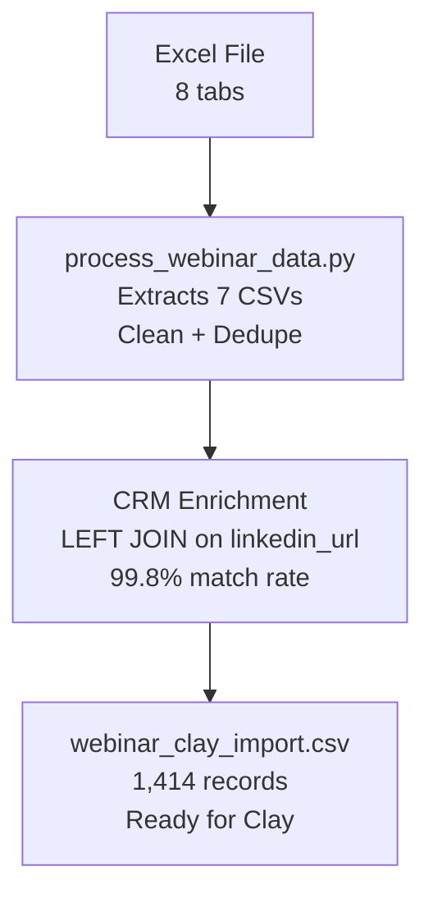

# Webinar Data Processing Pipeline

## 🚀 Simple, Powerful, Straightforward

Process any webinar Excel export into Clay-ready CSV files with one command.

## Usage

```bash
python3 process_webinar_data.py "path/to/your/webinar.xlsx"
```

**That's it!** The script handles everything automatically.

## ✅ What You Get

### Output Structure
```
processed_your_webinar_name/
├── attend list.csv              # Cleaned attendee data
├── CRM.csv                      # Customer data (required for enrichment)
├── did not attend list.csv      # Non-attendees
├── emoji eeaction.csv          # Emoji reactions
├── poll responses.csv          # Poll answers
├── Q&A transcript.csv          # Questions & answers
├── registered list.csv         # All registrants
├── webinar_clay_import.csv     # 🎯 READY FOR CLAY IMPORT
└── data_relationships.md       # Documentation
```

### 🎯 Clay Import File
- **1,400+ records** with **50+ columns**
- **BMID** as primary key for all records
- **LinkedIn URLs** for social data enrichment (100% coverage)
- **Company data** for firmographic enrichment
- **CRM enrichment** (required - 99.8% match rate)

## 🔄 Data Processing Flow



### Current Implementation
- **CRM Joined**: Company data merged into each registrant record (99.8% match)
- **Activity CSVs**: Extracted but not joined (available for future enrichment)

### Data Flow
```
Excel → 7 Clean CSVs → CRM Join → Clay Import
   ↓          ↓             ↓          ↓
Raw Data → Deduped → Enriched → Production Ready
```

## Clay Import Instructions

1. **Upload** `webinar_clay_import.csv` to Clay
2. **Set BMID as primary key**
3. **Configure automations**:
   - LinkedIn enrichment for social data
   - Company domain enrichment for firmographics
   - Lead scoring based on company data + registration info

## Requirements

```bash
# Install gnumeric for Excel processing
brew install gnumeric
```

## Examples

```bash
# Process any webinar export
python3 process_webinar_data.py "GTM Webinar December.xlsx"

# Works with any Excel file containing webinar data
python3 process_webinar_data.py "my_webinar_export.xlsx"
```

## What Makes It Powerful

- **Zero configuration** - Just provide the Excel file
- **Automatic cleaning** - Removes duplicates, null values, data corruption
- **Clay-optimized output** - Ready for enrichment automations
- **Shell-based reliability** - No complex dependencies
- **Future-proof** - Works with any webinar export format

---

## 🎉 Ready for Future Webinars?

Just run:
```bash
python3 process_webinar_data.py "your_next_webinar.xlsx"
```

**That's literally it!** 🚀